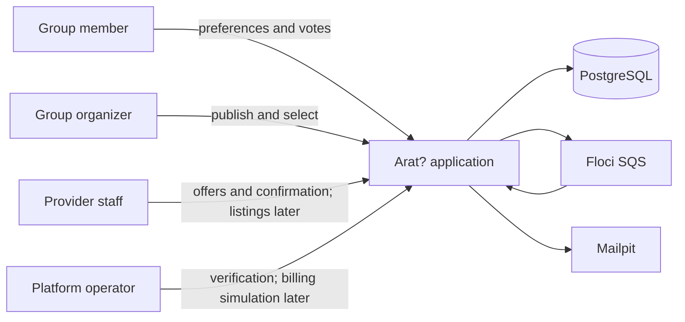
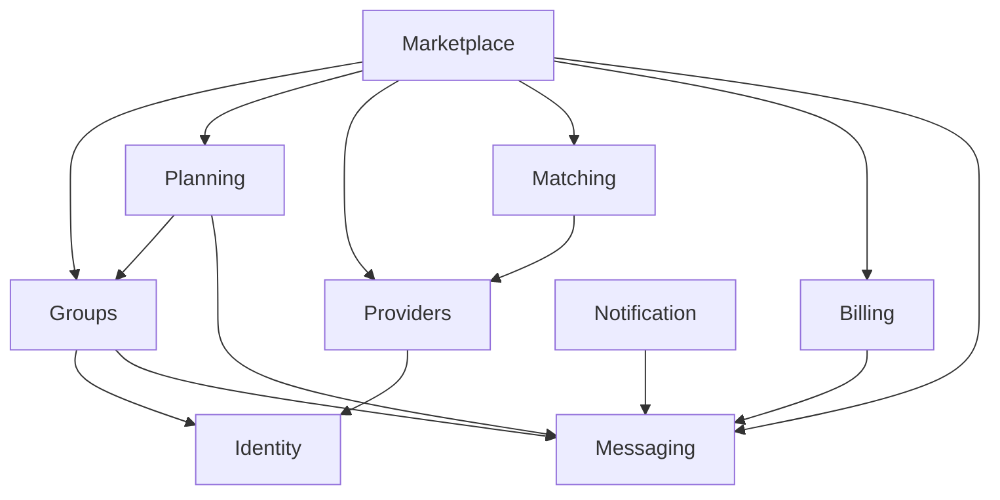
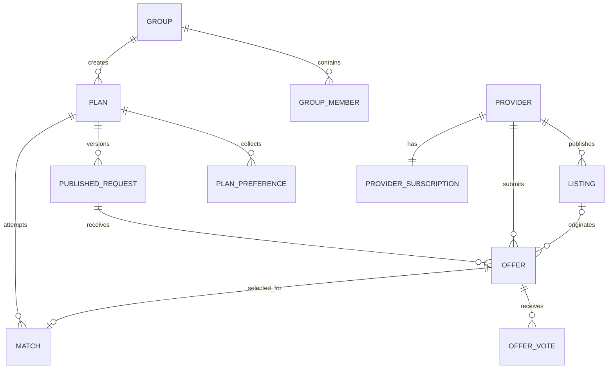
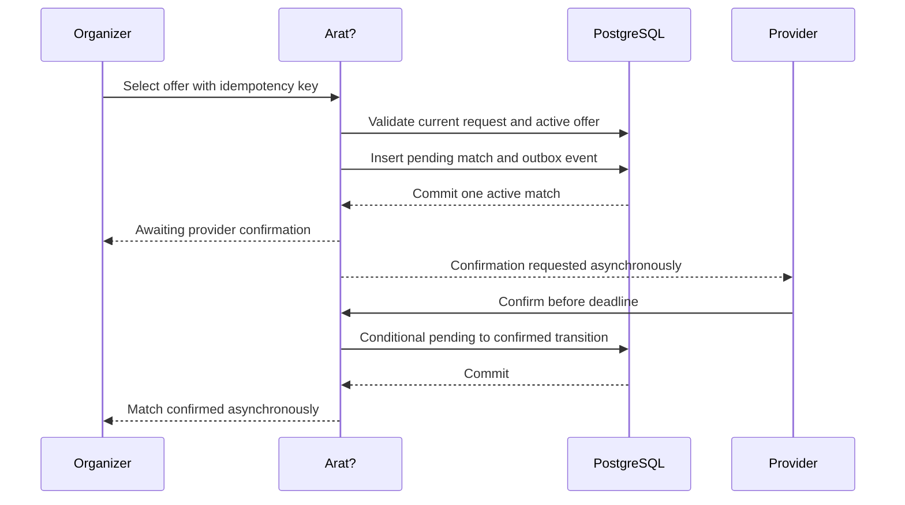

# Arat? Architecture

Status: Target design

This document describes the intended architecture. It is not evidence that every component has been implemented or load tested. Test and performance results must be added only after they are reproduced.

M2 is implemented: provider identity and eligibility, immutable finalization
and request publication, fixed recipients, authorized reads, and PostgreSQL
outbox capture. UI1 next adds a planned mobile-first Angular demonstration
client and privacy-scoped discovery reads for M0-M2. M3 remains planned after
UI1 and adds offers, votes, selection, confirmation, and matches.
M4 adds relay, AWS SDK/SQS/Floci, inbox, SMTP, email rendering, delivery retries,
and DLQ behavior. Listings, direct invitations, billing, advanced trust tooling,
geospatial search, and cloud deployment are deferred. The delivery components
in the diagrams below remain target architecture.

## 1. Purpose

Arat? is a group-first planning and provider-matching platform for casual outings. A group agrees on its schedule, headcount, budget, location, and requirements. The organizer can then publish an anonymized request to suitable providers. Providers submit sealed offers, group members vote, the organizer selects an offer, and the provider confirms or declines the match.

The request-first path is the Release 1 scope. A later listing extension adds
a second discovery path:

1. Request-first: a group publishes requirements and providers respond.
2. Listing-first: a group finds a provider listing and requests an offer.

Both paths converge on the same `Offer -> Match` workflow. This avoids two booking models with different correctness rules.

The system does not process real payments and does not claim real-time provider
inventory. A planned billing extension is simulated rather than connected to a
payment processor. A submitted offer expresses terms and apparent
availability; it becomes an agreement only after the provider confirms the
selected match.

## 2. Architecture drivers

The architecture is shaped by these requirements:

- Keep private group information separate from provider-visible requirements.
- Preserve exactly which request terms a provider answered.
- Allow many members to update preferences and votes concurrently.
- Guarantee that a single-destination plan has at most one active match.
- Resolve selection, withdrawal, expiration, confirmation, and timeout races deterministically.
- Accept retries from browsers, mobile clients, queues, and simulated billing callbacks.
- Deliver notifications asynchronously without losing committed domain changes.
- Run the complete development and test environment locally without an AWS account.
- Keep the implementation small enough for one engineer to understand and operate.

## 3. System context



Arat? is the authority for groups, plans, requests, offers, matches, and simulated provider subscriptions. PostgreSQL is the durable source of truth. SQS carries asynchronous work; it is not the authority for business state.

## 4. Architectural style

Arat? starts as a modular monolith built with Java 21 and Spring Boot. It is one deployable application with one PostgreSQL database, but code and schema ownership are divided into explicit business modules.

This is a deliberate choice:

- The consistency-sensitive workflows are easier to implement and explain with local database transactions.
- The initial scope and expected deployment size do not justify distributed transactions or independently operated services.
- Module boundaries still make dependencies visible and allow later extraction based on measured need.

See [ADR-0001](adr/0001-modular-monolith.md).

### 4.1 Layering inside each module

Each module follows the same small internal structure:

```text
module-name/
  api/             Public commands, queries, events, and DTOs
  application/     Use cases and transaction boundaries
  domain/          Domain rules, value objects, and state transitions
  infrastructure/  SQL, queue adapters, and external adapters
```

Controllers translate HTTP input and authentication context into application commands. They do not contain business rules. Persistence rows are not returned directly from the API.

An interface is introduced only at a real boundary, such as time, identity, queue delivery, or email delivery. The identity API is an interface even with one initial adapter because business modules must depend on an authenticated actor contract, not on the development or future production authentication mechanism. Internal classes do not receive an interface solely for test mocking.

### 4.2 Persistence approach

- Flyway owns reproducible schema migrations.
- PostgreSQL constraints enforce invariants that must survive concurrent application instances.
- `JdbcClient` and explicit SQL implement critical state transitions and contention-sensitive queries.
- Straightforward CRUD may use Spring Data JDBC when it does not obscure locking, predicates, or generated SQL important to correctness.
- PostgreSQL behavior is tested with Testcontainers. H2 is not used as a substitute.

See [ADR-0002](adr/0002-postgresql-coordination.md).

### 4.3 Planned Angular companion client (UI1)

The [Mobile Web Client Contract](web-client.md) freezes Angular 22, Node 24
LTS, npm, standalone components, strict TypeScript, reactive forms, signals
and services, generated OpenAPI types with explicit HTTP adapters, Vitest,
Playwright, and project-owned SCSS. The independent `ui/` workspace does not
couple Maven and frontend verification. It adds no business-state authority.

Use an Angular development proxy and a same-origin static web container that
proxies `/api` and `/v3` to Spring, preserving response headers and API errors.
The backend remains one modular monolith and PostgreSQL database. No broad
CORS, SSR, PWA, WebSockets, NgRx, or component library is justified. The normal
production build excludes fake identity; local Compose explicitly selects a
local-demo build. Production authentication remains absent and fails closed.
These are accepted decisions for planned work, not implemented deployment.

## 5. Modules and ownership

| Module | Owns | Does not own |
|---|---|---|
| Identity | User accounts, authentication identity, platform-level roles, sessions | Group membership or provider employment |
| Groups | Groups, memberships, invitations, organizer role | Plans, offers, provider profiles |
| Planning | Plans, requirement drafts, candidate dates, attendance, preferences, immutable finalizations and request versions | Provider offers, votes, or matches |
| Marketplace | Publication use case, request recipients, offers, offer votes, selection attempts, matches | Provider profile content or notification delivery |
| Providers | Provider organizations, staff, verification, eligibility versions, service areas, capabilities; listings later | Match state or provider subscription billing |
| Matching | Eligibility rules for selecting request recipients | Any durable business or delivery state |
| Billing (extension) | Simulated subscriptions, entitlements, usage counters, and billing event inbox | Invoices, real payment instruments, or settlement |
| Messaging | M2 outbox persistence and versioned envelopes; M4 relay claims and consumer inbox deduplication | Social chat or domain decisions |
| Notification | Notification preferences, delivery jobs, email rendering, delivery attempts | Domain decisions that cause notifications |

### 5.1 Dependency direction

Modules communicate through explicit module APIs and domain events. They must not query another module's tables directly.

The direct children of `com.builtbyjuls.arat` that contain production code are
business modules, except `platform` and the current transitional `web` package.
`web` contains shared HTTP support and has the same technical-support role as
`platform` until it is renamed. A business module may reference another
business module only through its `api` package. The `platform` and `web`
technical-support packages must not reference business modules. Architecture
tests enforce these rules and require business-module dependency slices to be
cycle-free.



The arrows show allowed use of a module's public API, not table ownership. Notification consumes facts emitted by other modules. Domain modules do not call email or SQS to complete a transaction.

Potential dependency cycles are avoided as follows:

- Marketplace stores referenced identity values and validated snapshots, not foreign module objects.
- Marketplace passes the immutable request criteria to Matching, which applies
  eligibility rules against provider data exposed by Providers. Marketplace
  records the resulting bounded recipient set during publication. Matching
  owns no durable state.
- Notification consumes events and never changes marketplace state.
- Billing exposes entitlements to Marketplace but does not decide which provider matches a request.

Module boundary tests will fail the build if code imports another module's internal packages.

### 5.2 Cross-module transaction owners

Module ownership does not mean each call opens a separate transaction. Public
module APIs are in-process calls that may join the transaction opened by the
application use case that coordinates them.

- Planning owns requirement finalization: under group then plan locks it
  verifies organizer authority, plan ETag, one active window, and database
  deadline, then copies publishable terms without changing plan state/version.
- Marketplace owns `PublishRequest`. Authentication and the idempotency claim
  precede group then plan locks. Groups verifies current organizer authority;
  Planning checks ETag, state, finalization basis, and database deadline, and
  creates the immutable version. Matching queries Providers for distinct
  verified provider IDs and observed eligibility versions. Marketplace stores
  fixed recipients; Messaging appends per-recipient events in the same caller
  transaction, together with audit and idempotency completion.
- Marketplace also owns M2 request closure and the request-aware cancellation
  route. It delegates plan/request state changes to Planning, preserving the
  route without a Planning-to-Marketplace cycle. Closure/cancellation clears
  the same-plan current pointer and retains history.
- From M3, Marketplace also owns offer submission, selection, confirmation,
  decline, vote, and timeout use cases. It calls Groups, Planning, and Providers for
  guarded authority and state changes in the documented lock order, Billing
  for a quota claim when required, and Messaging for outbox writes.
- Each called module changes only its own tables. The transaction owner may
  coordinate public module APIs but may not query another module's tables
  directly.

This preserves one PostgreSQL commit for the invariant without hiding the
dependency behind a distributed workflow.

## 6. Core domain model



Important modeling choices:

- A `Plan` is the private collaboration space for one outing.
- A `PublishedRequest` is an immutable provider-visible snapshot. Material changes create a new version.
- An `Offer` is a sealed response to exactly one request version. It is not silently rewritten when a plan changes.
- Votes advise the organizer. They do not automatically select an offer.
- Selecting an offer creates a `Match` in `AWAITING_PROVIDER_CONFIRMATION`.
- A match becomes `CONFIRMED` only when an authorized provider staff member confirms it before the deadline.
- A plan may have only one active match, while declined, timed-out, and cancelled attempts remain available for audit. At most one match may ever reach `CONFIRMED` for a plan.

See [ADR-0003](adr/0003-versioned-requests-and-provider-confirmation.md).

## 7. Critical workflows

### 7.1 Request-first workflow (M2, implemented)

```mermaid
sequenceDiagram
    participant O as Organizer
    participant A as Arat?
    participant DB as PostgreSQL
    participant P as Provider staff

    O->>A: Finalize chosen window and deadline with plan ETag
    A->>DB: Lock group then plan; copy immutable finalization
    DB-->>A: Commit without changing plan version
    A-->>O: Finalization and advisory warnings
    O->>A: Publish finalization with key and plan ETag
    A->>DB: Claim key; lock group then plan; validate finalization
    A->>DB: Supersede N; insert N+1, fixed recipients, audit, outbox, replay reference
    DB-->>A: Commit all state atomically
    A-->>O: OPEN published request
    P->>A: Read feed in explicit provider context
    A->>DB: Check staff, VERIFIED, ACTIVE recipient, eligibility version
    A-->>P: Allowlisted snapshot, lifecycle state, database-time actionable flag
```

M2 ends at this database-backed boundary. M3 adds offers and matches; M4 relays
the already captured events and delivers notifications.

Matching owns rules only. It selects `VERIFIED` providers by exact category
membership and configured opaque service-area code, returning distinct provider
IDs and observed eligibility versions in provider UUID ascending order.
Request radius is context, not geospatial calculation. Deduplication precedes
the externally configurable cap (default 100, allowed 1-500); zero or too many
candidates rejects publication without changing domain state.

Publication does not lock the candidate provider set after the plan lock.
Provider root mutations that cannot change `provider_id` use `FOR NO KEY UPDATE`
so implicit recipient foreign-key `KEY SHARE` locks remain compatible; this
requires real PostgreSQL test evidence. Every later request access rechecks
active staff, `VERIFIED`, `ACTIVE` recipient, and captured/current eligibility
equality. Suspension and restoration advance eligibility monotonically; old
grants never revive. Profile edits advance provider version only and affect
future matching without rewriting old grants.

The committed audience is fixed. Initial publication captures one
`ProviderRequestPublished:{requestId}:{providerId}` outbox business key per
recipient; replacement, closure, and cancellation capture corresponding
per-recipient terminal events for the old audience. Recovery cannot add
recipients. M4 stale delivery is skipped after eligibility rechecks.

Private requirement/preference edits remain allowed in `OPEN_FOR_OFFERS` and
never mutate or close N. Direct republication atomically supersedes N with N+1
and a new audience. Planning enforces snapshot and ordered-child immutability
in PostgreSQL. Finalization/publication replay stores compact resource
references and reconstructs original content, including the original `OPEN`
publication result after later lifecycle changes. The generic 16 KB replay
bound and sensitive-key guard remain unchanged.

Provider detail and feed return only the API allowlist. Free-text publishable
fields are deliberate organizer input, with no automatic PII detection or
redaction guarantee. Recipient pagination uses created-at descending then
request ID descending, provider-bound opaque versioned cursors, default 20 and
maximum 100. There are no category/area filters or post-page filtering.
Authorized terminal history can remain readable; effective actionability uses
database time even though M2 has no expiry worker.

### 7.2 Listing-first workflow (listing extension)

The group adds a provider listing to its plan and asks that provider for a custom offer. Arat? still creates a published request version, but its initial audience contains the chosen provider. The provider submits the same `Offer` used in the request-first path.

This design keeps voting, selection, confirmation, auditing, and failure handling identical in both paths.

### 7.3 Offer selection and confirmation (M3; delivery in M4)



The unique active-match constraint, not an in-memory lock, decides simultaneous selection attempts. Provider confirmation and timeout use database time and conditional state transitions.

## 8. Transaction boundaries

Transactions are narrow and contain only database work. No HTTP, SQS, email, geocoding, or other network request occurs inside a domain transaction.

| Use case | Transaction contents | After commit |
|---|---|---|
| Finalize requirements (M2) | Claim key, lock group then plan, verify organizer, ETag, selected window and database deadline; persist immutable terms and advisory summary | Return finalization; no plan state/version change |
| Publish request (M2) | Claim key, lock group then plan and current request, verify organizer, ETag, finalization basis and deadline; supersede N, create N+1, fixed recipients, audit, outbox rows and compact replay result | Return request; relay deferred to M4 |
| Close request / cancel plan (M2) | Claim key, lock group then plan then request, validate organizer and ETag, terminalize request, clear current pointer, update plan, audit, append per-recipient terminal events and complete replay | Return result; delivery deferred to M4 |
| Submit offer | Claim idempotency key, validate provider and current request version, insert sealed offer, append outbox event | Notify group members |
| Cast vote | Lock group, plan, request, and offer; verify current member; conditionally create or version the member's vote | Optional notification aggregation |
| Select offer | Claim idempotency key, lock group, provider, then plan; verify current organizer and plan ETag; validate offer and deadline; create one pending match; update plan state; append outbox event | Ask provider to confirm |
| Confirm match | Lock provider, plan, request, affected offers, then match; verify authority, eligibility, and database deadline; transition to confirmed; close the request; mark other offers not selected; append outbox event | Notify group |
| Expire confirmation | Lock plan, request, affected offers, then match; transition overdue pending match to timed out; reopen the request or close it and mark remaining submitted offers not selected; update the plan; append outbox event | Notify both parties |
| Process simulated billing event | Deduplicate event, transition subscription, append audit and outbox events | Notify provider staff |

Offer/match rows begin in M3; all notification delivery in this table begins
in M4. Billing remains deferred. Detailed race outcomes and lock order are
specified in [Consistency and Concurrency](consistency-and-concurrency.md).

## 9. Asynchronous processing

The outbox implements capture in M2 and reserves delivery for M4. Messaging's
M2 append API joins the caller transaction; the immutable versioned envelope
contains only safe identifiers and minimal event facts. It contains no private
fields. No M2 business command waits for a queue or notification.

The complete M4 target uses the transactional outbox pattern:

1. A domain transaction changes business state and inserts an outbox row atomically.
2. A relay claims committed rows in bounded batches using `FOR UPDATE SKIP LOCKED`.
3. The relay sends messages to SQS.
4. Consumers record the event identifier in an inbox table in the same transaction as their side effect.
5. Repeated delivery returns success without repeating the side effect.

Delivery is at least once. The design does not claim exactly-once messaging.

Release 1 queues:

- `arat-notifications`: one standard queue for email and in-application notification work.
- `arat-notifications-dlq`: one dead-letter queue for notification messages that exhaust the retry policy.

Provider matching does not use SQS in Release 1. Publication calculates a bounded recipient set and stores it in PostgreSQL. Notification outbox rows for those recipients are relayed through the single notification queue.

Floci provides local SQS-compatible queues. Queue endpoints and credentials are external configuration so the same adapters can target AWS SQS later. Mailpit captures local email and is not presented as an AWS emulator.

## 10. API principles

- JSON over HTTP for the MVP.
- Stable resource identifiers are UUIDs generated by the application.
- Commands that may be retried accept an `Idempotency-Key` header.
- Updates use explicit commands such as `/offers/{id}/withdraw` or `/matches/{id}/confirm`, not generic status mutation.
- Request validation errors use predictable problem details.
- Authorization is checked at the application boundary and again where ownership is material to a state change.
- List endpoints use cursor pagination; unbounded lists are prohibited.
- Timestamps are returned in UTC with explicit offsets. A plan stores its display time zone separately.
- Monetary values use a decimal string plus an ISO currency code at the HTTP
  boundary and integer minor units in PostgreSQL. The MVP uses PHP centavos
  internally.

## 11. Security and privacy boundaries

- Provider-visible requests contain only the published snapshot, never the private planning discussion.
- Snapshot projection excludes group ID/name, plan title, creator/member
  identity, preferences, attendance, private notes, employer and direct contact
  fields. `providerSafeNotes`, must-haves, and string category attributes remain
  deliberately publishable text; automatic PII detection/redaction is not promised.
- Provider staff can act only for provider organizations where they have active membership.
- Contact details are revealed only after a match reaches the intended state.
- Audit records capture actor, action, target, time, request correlation, and material state change without copying secrets.
- Logs must not contain invitation tokens, session tokens, or private message bodies.
- Invite tokens and password-reset tokens are stored hashed.

Public stranger recruitment, minors, real payment data, and an open social feed are outside the MVP threat model.

## 12. Observability

Spring Boot Actuator and Micrometer provide health and operational metrics. Structured logs include `trace_id`, `request_id`, `actor_id` where safe, `plan_id`, and `provider_id` where relevant.

Initial metrics include:

- HTTP request rate, latency, and error rate by route family
- Database pool utilization and query latency
- Offer submissions, selections, confirmations, declines, and timeouts
- Selection conflict count
- Idempotency replay and key-mismatch counts
- Outbox oldest-row age and unpublished-row count
- Queue depth, consumer latency, retry count, and dead-letter count
- Notification success and permanent-failure counts
- Matching fan-out size and completion latency

Metrics must distinguish product outcomes from infrastructure failures. For example, a provider decline is not a server error.

No performance numbers belong in documentation until a versioned test scenario, environment, command, and raw result are committed.

## 13. Local deployment and future AWS mapping

The complete local environment runs with Docker Compose:

| Concern | Local | Possible future AWS | Migration boundary |
|---|---|---|---|
| Application | Spring Boot container | ECS/Fargate or another container runtime | OCI image and environment configuration |
| Durable state | PostgreSQL container | RDS PostgreSQL | JDBC, Flyway, PostgreSQL-compatible SQL |
| Async queues | Floci SQS | Amazon SQS | AWS SDK endpoint and credentials |
| Email capture/delivery | Mailpit | Amazon SES or another provider | Notification delivery adapter |
| Metrics | Actuator scrape/log output | Managed metrics platform | Micrometer registry configuration |

These mappings are evolution options, not promises to deploy every AWS service. Local development and automated tests require no AWS account.

## 14. Testing architecture

Testing is part of the design:

- Unit tests cover pure policies such as audience matching, offer eligibility, and entitlement rules.
- Module tests verify authorization and state transitions through public application APIs.
- PostgreSQL Testcontainers tests prove constraints, transaction behavior, and database-time boundaries.
- Concurrency tests coordinate real threads with barriers and verify one observable winner.
- Queue integration tests verify duplicate delivery, retry, and inbox behavior against Floci where appropriate.
- End-to-end tests exercise request publication through offer confirmation using the local stack.
- Load tests model broad marketplace traffic separately from a deliberately contested plan.

Tests must assert durable outcomes, not only HTTP status codes. Examples include one active match, one inbox record, one contribution to usage, and an outbox event matching the committed transition.

## 15. Deliberate omissions

The initial architecture does not include:

- Microservices
- Redis or distributed locks
- Kafka
- Kubernetes
- Real payment processing
- Guaranteed provider inventory
- Dynamic pricing or auctions
- AI recommendations
- Public social discovery
- Native mobile applications
- Cross-provider package bookings

Each omission reduces operational and consistency surface while preserving the project's central engineering value.

## 16. Evolution criteria

Architecture changes should respond to evidence:

- Extract a module only when it needs independent deployment, scaling, or data isolation.
- Add a cache only after query measurements identify a read bottleneck and an invalidation strategy is documented.
- Add provider calendar integrations only after the confirmation workflow is stable and a provider supplies an authoritative inventory API.
- Introduce real billing only with a defined merchant model, refund policy, dispute handling, and compliance review.
- Add new activity categories only after matching quality and provider liquidity are measurable in the initial categories.
