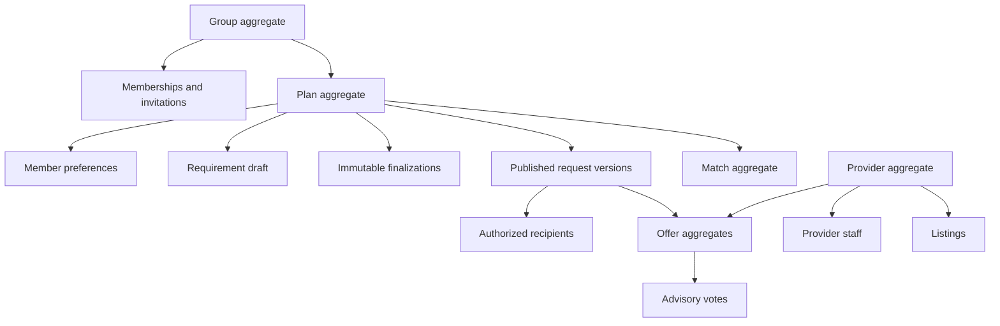
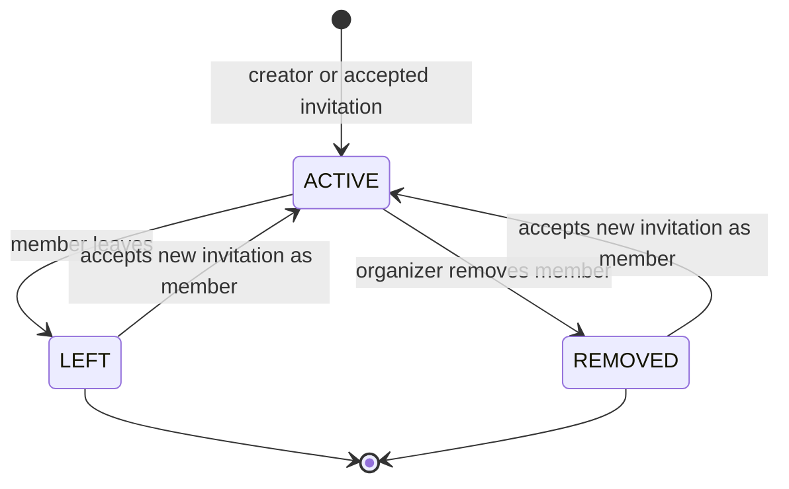
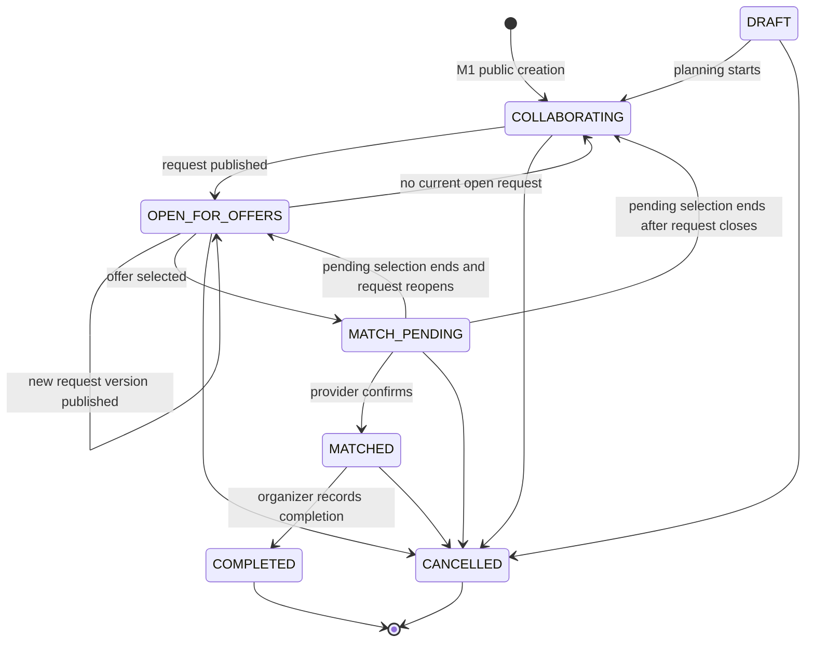
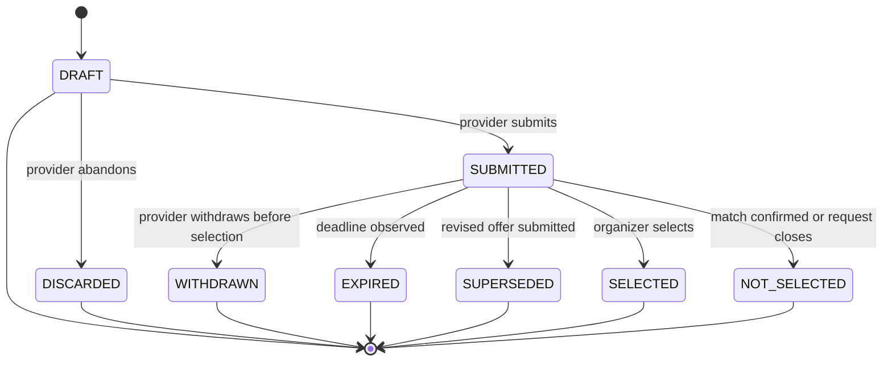
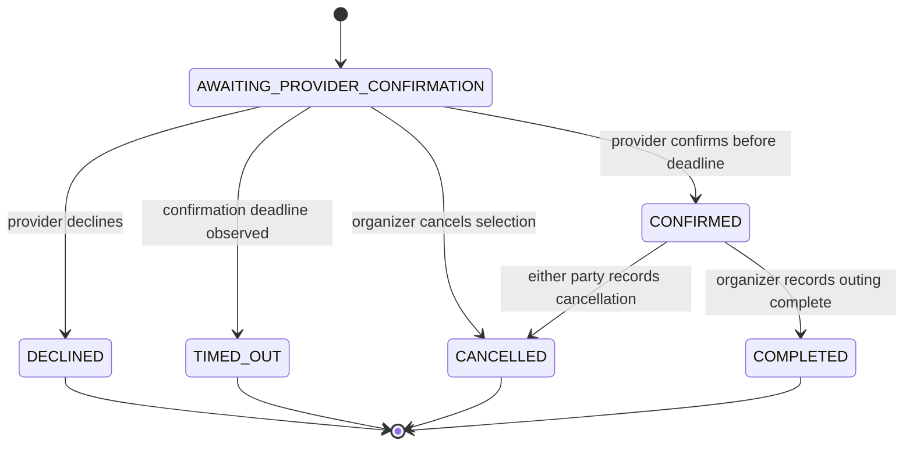
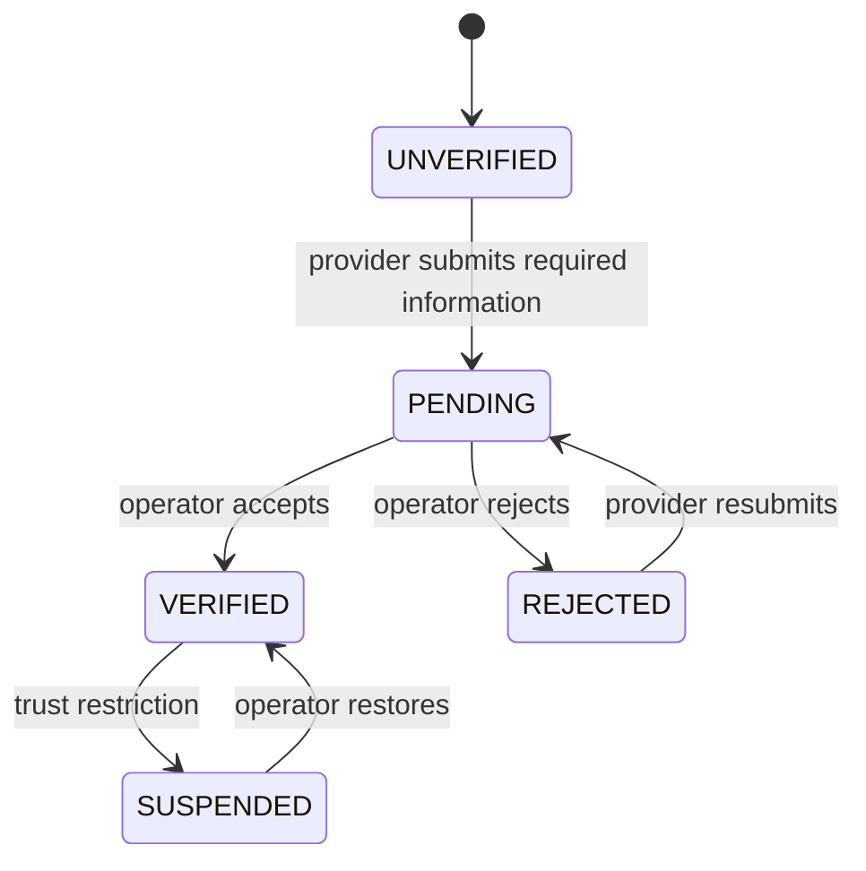
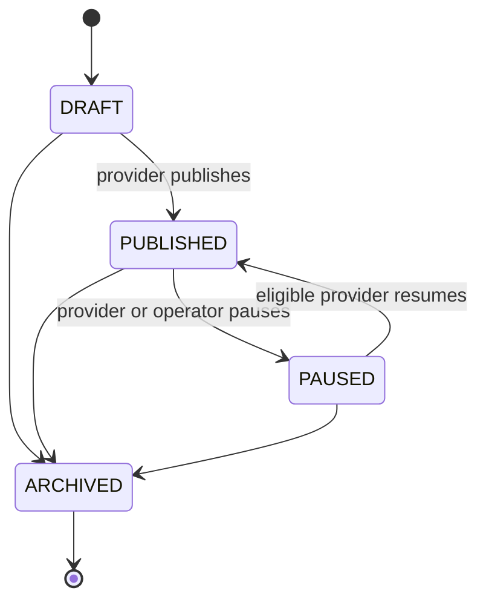
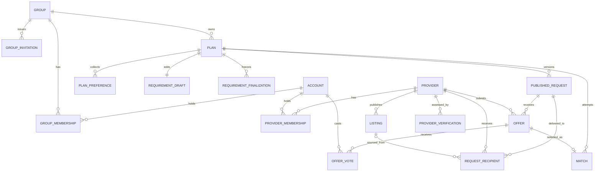

# Domain and Data Model

## Modeling goals

The domain model makes four facts explicit:

1. The private group and its plan are primary; provider discovery is secondary.
2. Published requirements are versioned facts, not mutable form data.
3. Provider offers are sealed, structured proposals against one exact version.
4. A confirmed `Match` records mutual intent but is not a payment-backed
   `Booking`.

The model favors visible domain constraints over generic abstractions. The
names below are target design terms and do not imply that implementation is
already complete. M2 provider profiles are implemented; finalizations, requests,
recipients, and outbox capture are planned next. Offers, votes, selection, confirmation,
and matches begin in M3; relay and delivery begin in M4.

## Bounded contexts

The first release is a modular monolith with these logical domain boundaries:

- **Identity** owns accounts, authentication identity, platform-level roles,
  and sessions.
- **Groups** owns groups, membership, invitations, and organizer authority.
- **Planning** owns plans, preferences, requirement drafts, immutable
  finalizations, and immutable request versions.
- **Marketplace** owns request recipients, offers, votes, selection attempts,
  and matches.
- **Providers** owns provider organizations, staff membership, service areas,
  listings, verification state, and provider restrictions.
- **Matching** owns only recipient-eligibility rules. It owns no durable state.
- **Billing** owns simulated subscriptions, entitlements, usage counters, and
  billing-event deduplication. It does not own marketplace rules.
- **Messaging** owns the outbox, relay claims, event envelopes, and consumer
  inbox deduplication.
- **Notification** owns notification preferences, delivery jobs, and attempts.

Trust and safety is a policy applied by the modules that own the affected
records, not a separate deployable service or a second owner of those records.

These are module boundaries, not separately deployed services.

## Ubiquitous language

### Group

A private set of people who already know one another and coordinate outings.
The first creator is an organizer.

### Group membership

The relationship between one account and one group, including its role and
membership state. Identity and authorization come from this relationship, not
from a group ID supplied without authentication.

### Plan

The group's working record for one proposed outing. It links collaboration
data, published request versions, offers, and the eventual match into one
workflow. The module boundaries above still determine which module owns each
record.

### Plan preference

One member's availability, attendance intent, guest count, budget preference,
or ranked option. Preferences are private advisory inputs. Finalization reports
current and stale input counts to the organizer but never silently derives provider terms from
preferences or includes preferences in the provider snapshot.

### Requirement draft

The organizer-editable category, schedule, area, headcount, budget, and
requirements for a plan. It is private and mutable.

### Requirement finalization

An immutable copy of provider-publishable terms and one chosen active window,
based on the locked current plan version. Planning owns it. It does not publish
or change the plan; publication rejects a stale basis.

### Published request

An immutable, numbered, anonymized snapshot derived from a requirement draft.
It is the exact contract context against which providers quote.

### Request recipient

The record authorizing one verified provider to view one published request. A
recipient may be selected by category and service-area matching or explicitly
invited from a listing.

### Provider

A business organization that can publish listings and submit offers. Provider
staff membership is distinct from group membership.

### Listing

A provider-authored description of a discoverable service. It is an input to
discovery, not reservable inventory and not an offer.

### Offer

A sealed, structured, expiring provider proposal for one published request
version. The group sees it; other providers do not.

### Offer revision

A new immutable offer that supersedes an earlier offer when price, schedule,
capacity, inclusions, or conditions change. Submitted offer terms are never
edited in place.

### Vote

One active member's current advisory preference for one offer. Voting does not
select or accept an offer.

### Match

The workflow record created by organizer selection. It stores the selected
offer and request snapshots while awaiting the provider. If the provider
confirms, it becomes the durable record of what both sides agreed to pursue. It
does not prove payment, availability outside the stated terms, attendance, or
fulfillment.

## Aggregate ownership



Ownership in this diagram expresses lifecycle and authorization. It does not
require loading an entire object graph for every command.

## State machines

### Group membership



Only `ACTIVE` membership grants group access. Invitations are separate records,
with `PENDING`, `EXPIRED`, `REVOKED`, and `CONSUMED` states, and do not grant
access. An active member cannot receive an invitation. A former member can
accept a new invitation and reactivate only as `MEMBER`. The final active
organizer cannot leave or be removed until organizer authority is transferred
or the group is closed.

### Plan



Guards:

- M2 adds `OPEN_FOR_OFFERS` to the implemented M1 plan states. `DRAFT` stays
  reserved; match-related transitions and completion begin in M3.
- `OPEN_FOR_OFFERS` requires exactly one current request in `OPEN` state.
  In M2 only this plan state may hold a current-request reference, which must
  reference a request belonging to the same plan. Closure and cancellation
  clear it. M3 extends the pointer rule to `MATCH_PENDING`.
- `MATCH_PENDING` requires exactly one match in
  `AWAITING_PROVIDER_CONFIRMATION` state and a current request in
  `SELECTION_PENDING` state.
- `MATCHED` requires exactly one match in `CONFIRMED` state.
- `COMPLETED` and `CANCELLED` are terminal in the MVP.
- Requirement and preference writes are allowed in `COLLABORATING` and
  `OPEN_FOR_OFFERS`. Draft edits never mutate or close current request N.
  Finalization and direct republication create N+1 while N stays current until
  that transaction commits. No close-first gap is required.
- A confirmed match cannot be amended in place. Cancellation preserves the
  accepted snapshots. A materially different outing requires another plan.

### Published request



```mermaid
stateDiagram-v2
    [*] --> OPEN
    OPEN --> SELECTION_PENDING: organizer selects offer
    OPEN --> SUPERSEDED: newer version published
    OPEN --> CLOSED: organizer closes; expiry transition after M2
    OPEN --> CANCELLED: plan cancelled
    SELECTION_PENDING --> OPEN: selection ends before offer deadline
    SELECTION_PENDING --> CLOSED: provider confirms or selection ends after deadline
    SELECTION_PENDING --> CANCELLED: plan cancelled
    CLOSED --> [*]
    SUPERSEDED --> [*]
    CANCELLED --> [*]
```

M2 creates only `OPEN`, `SUPERSEDED`, `CLOSED`, and `CANCELLED`. M2 has no
expiry worker: database time controls the effective actionable flag even if
stored lifecycle state remains `OPEN` after the deadline. Manual closure
accepts only `OPEN`, returns the plan to `COLLABORATING`, and clears its current
pointer. Plan cancellation also accepts `OPEN_FOR_OFFERS` and atomically
cancels its request, clears the pointer, and preserves history.

The selection transitions in the diagram describe M3. `OPEN` is the only state
that accepts new offers or selection. While a provider confirmation is pending, `SELECTION_PENDING` prevents more provider work. A
decline, timeout, or organizer cancellation returns the request to `OPEN` only
when its offer deadline remains in the future; otherwise it becomes `CLOSED`.
No state permits snapshot mutation. The effective deadline is evaluated during
every write, so a delayed cleanup job is not required to make an expired
request ineligible.

Publishing version `n + 1` atomically marks the current `OPEN` version as
`SUPERSEDED` and installs the new version as the plan's current request.

### Offer



Submission freezes all quote fields. An offer is eligible for selection only
when all of these are true in the selecting transaction:

- Its state is `SUBMITTED`.
- Its own expiration is after database current time.
- Its request is `OPEN`, current for the plan, and before its offer deadline.
- Its provider is active and not restricted.
- Its quoted schedule and capacity satisfy the published request.
- The plan has no active match.

The `SELECTED` state is terminal. If the provider later declines or times out,
the provider must submit a new offer to be considered again. This prevents an
old selection from being silently reactivated.

### Match



An active match is one in `AWAITING_PROVIDER_CONFIRMATION` or `CONFIRMED`. There
may be at most one active match per plan. The MVP permits at most one match ever
to reach `CONFIRMED` for a plan. A failed pending match may be followed by
selection of a different currently eligible offer.

Confirmation is conditional on `confirmation_deadline > database_now` in the
same transaction that changes the state. A timeout worker records overdue
matches, but correctness does not depend on the worker running exactly on time.

### Provider verification



In M2 only `VERIFIED` providers qualify for matching and authorized request
access. Submission by an active provider `ADMIN` takes `UNVERIFIED` or
`REJECTED` to `PENDING`. A `PLATFORM_OPERATOR` accepts or rejects `PENDING`,
suspends `VERIFIED`, or restores `SUSPENDED`. Each actual transition increments
both provider version and monotonic eligibility version exactly once; exact
replay increments neither. Restoration never reinstates an old version.
Evidence is 1-10 unique printable ASCII opaque references of 1-256 characters,
not uploads or recipient-visible data. Optional decision notes are at most 500
characters; suspension requires a trimmed 1-500 character reason.

M3 requires `VERIFIED` for offers and confirmation; M4 rechecks it for delivery.
Verification means only that an operator reviewed configured organization and
contact evidence. It is not a guarantee of safety, licensing, service quality,
inventory, or a platform recommendation.
In M3, suspension also blocks confirmation. If a match is still awaiting
confirmation, the suspension workflow cancels that attempt and reopens or closes its request
according to the request deadline. A confirmed match is retained for review and
is never silently rewritten.

### Listing



A listing can be published only while its provider is verified and active.
Pausing or archiving it never changes historical offers or matches.

## Logical data model



## Key records and constraints

### `group_account`

Important fields:

- `id`
- `name`
- `status`
- `created_by_account_id`
- `version`
- `created_at`

The table name avoids using the reserved SQL word `group`.

### `group_membership`

Important fields:

- `group_id`
- `account_id`
- `role`: `MEMBER` or `ORGANIZER`
- `status`
- `joined_at`
- `ended_at`

Constraints:

- Unique `(group_id, account_id)` relationship
- Only active memberships authorize reads or writes
- At least one active organizer is maintained by the membership command
  transaction

Membership commands lock the group root before changing roles or status.
Commands that depend on current group authority take the same lock before
checking membership, so removal or organizer transfer cannot invalidate an
in-flight authorization decision.

### `group_invitation`

Important fields:

- `id`, `group_id`, and `invitee_account_id`
- `state`: `PENDING`, `EXPIRED`, `REVOKED`, or `CONSUMED`
- `expires_at`, `created_at`, `consumed_at`, and `revoked_at`
- `key_id`, 32-byte `nonce`, and SHA-256 `token_digest`

The raw token is never stored. Creation generates a 32-byte random nonce and
uses the active configured HMAC key to derive 32 raw bytes with HMAC-SHA-256.
The input is UTF-8 text containing exactly these newline-separated fields:
`arat-invite:v1`, lowercase canonical invitation UUID, lowercase canonical
group UUID, lowercase canonical invitee-account UUID, and unpadded Base64url
nonce. The derived token is unpadded Base64url; lookup hashes its 32 raw HMAC
bytes, not encoded text. The record persists the key ID, nonce, and digest.

Configuration has an active key ID and a map of Base64-encoded keys of at least
32 bytes. Local and test profiles use an explicit fake key. Every other profile
fails startup if the key is absent. Old configured keys remain available until
their invitations and idempotency records can no longer replay. A partial unique
constraint permits at most one `PENDING` invitation for `(group_id,
invitee_account_id)`; creation locks the group and first marks an effectively
expired pending record `EXPIRED`.

### `plan`

Important fields:

- `id`
- `group_id`
- `title`
- `state`
- `current_request_id`, nullable
- `created_by_account_id`
- `version`
- `created_at`
- `updated_at`

`version` supports optimistic concurrency for organizer edits and commands
such as publication and selection. Those commands compare the supplied plan
ETag while holding the plan lock and still use atomic state predicates and
database constraints; the version field is not their only guard.

M1 public creation sets `COLLABORATING`; `DRAFT` is reserved internal state and
is not an M1 create result. Requirement replacement advances this version.

### `plan_preference`

One current aggregate row exists per plan and member. Important fields include:

- `plan_id`
- `account_id`
- Structured availability windows
- `basis_plan_version`
- Attendance intent: `INTERESTED`, `AVAILABLE`, `JOINING`, or `NOT_JOINING`
- Guest count
- Budget ceiling in integer centavos
- Ranked activity or amenity preferences
- Private group-visible note
- `version`

Unique `(plan_id, account_id)` makes the HTTP resource and ETag unambiguous.
The first write uses a create precondition; replacements compare and increment
`version`. A preference is current only when `basis_plan_version` equals the
current plan version. It preserves the originally submitted basis when a later
requirement replacement makes it stale. Preferences may change while planning
remains open. They are never treated as payments or enforceable commitments.

### `requirement_draft`

Contains mutable organizer inputs:

- `category`
- Candidate-window rows with stable UUIDs and retirement state
- Area code and maximum travel radius
- IANA time zone
- Minimum and maximum headcount
- Budget range in integer centavos and currency `PHP`
- Ordered unique must-haves
- Structured category attributes
- Provider-safe notes

The draft uses the plan version; the offer deadline is supplied at finalization,
not stored in the M1 draft.

The application validates the public M1 limits in the
[API Contract](api-contract.md#milestone-1-collaboration-contract). Removed
candidate windows are retired rather than deleted, preserving explainable
preference references. Integer minor units are persistence-only; public money
uses exact two-decimal PHP strings.

### `requirement_finalization` (M2, planned)

Planning stores an immutable finalization ID, plan ID, basis plan version,
chosen active candidate-window ID and copied start/end values, offer deadline,
and the provider-publishable fields listed below. It captures bounded aggregate
counts of current and stale submitted preferences and warnings without changing
organizer terms. Finalization is allowed in `COLLABORATING` and
`OPEN_FOR_OFFERS`, locks group then plan for organizer authority and `If-Match`,
and does not change plan state or increment plan version. PostgreSQL decision
time requires `now < offer_deadline < chosen_start`.

Requirement replacement advances plan version and makes an older finalization
stale. Publication accepts only a same-plan finalization whose basis version
equals the locked current plan version and whose deadline is still future.

### `published_request`

Important fields:

- `id`
- `plan_id`
- `request_version`
- `state`
- `distribution_mode`: `MATCHED_POOL` or `DIRECT_INVITATION`
- Snapshot fields for category, area, schedule, headcount, budget, requirements,
  and provider-safe notes
- `offer_deadline`
- `published_by_account_id`
- `published_at`
- `closed_at`

Constraints:

- Unique `(plan_id, request_version)`
- At most one current request in `OPEN` or `SELECTION_PENDING` per plan
- Snapshot columns and ordered child content cannot be updated or deleted
  after insertion; PostgreSQL enforces immutability
- `offer_deadline < requested_start_at`
- Recipient generation and publication occur in one transaction
- The committed recipient set is fixed for the lifetime of the request version

`MATCHED_POOL` and `DIRECT_INVITATION` are mutually exclusive for one request
version. A listing invitation publishes a new targeted request version and
supersedes any current version; the MVP does not add a direct provider to an
existing matched-pool audience. The core request-first release implements only
`MATCHED_POOL`; `DIRECT_INVITATION` begins with the listing extension.

Recovery can replay notification work for existing recipients, but it cannot
rerun matching to expand this audience. Changed eligibility or a desired wider
audience requires publishing a new immutable request version.

PostgreSQL guards immutable snapshot fields and ordered child content against
direct SQL mutation, including child insertion, update, and deletion after the
snapshot is complete. Only guarded lifecycle commands change state metadata.

The provider snapshot allowlist is category, time zone, area code and radius,
one chosen start/end window, headcount range, optional PHP budget, ordered
must-haves, category attributes, provider-safe notes, and offer deadline.
Provider responses add only request ID/version, publication time, lifecycle
state, and the database-time effective actionable flag. They exclude group ID
and name, plan title, creator and member identity, preferences, attendance,
private notes, employer, and direct contact fields. Must-haves, string category
attributes, and `providerSafeNotes` are deliberately publishable organizer text;
there is no automatic PII detection or redaction guarantee. Existing M1 field
bounds apply, including valid multibyte content.

### `request_recipient`

Important fields:

- `published_request_id`
- `provider_id`
- `provider_eligibility_version`
- `source`: `MATCH_RULE` or `LISTING_INVITATION`
- `source_listing_id`, nullable
- `access_state`: `ACTIVE` or `REVOKED`
- `revoked_at`, `revoked_by_account_id`, and `revocation_reason`, nullable
- Delivery metadata is deferred to M4
- `created_at`

Unique `(published_request_id, provider_id)` prevents duplicate recipient
authorization when several matching rules select the same provider. The
notification outbox uses a separate deterministic business key to prevent a
second initial-notification job.
In M2 recipients use `MATCH_RULE`. An `ACTIVE` recipient, active staff
membership in the explicit provider route context, current `VERIFIED` state,
and equal stored/current eligibility versions are required for every request
read, including terminal history. Profile edits never rewrite this grant.
Restoration cannot revive a stale grant. Cross-provider and non-recipient
reads return the same private-resource not-found response.

The recipient-owned feed orders by `created_at DESC`, then request ID
descending, with opaque versioned cursors bound to provider ID and limit 20
by default, maximum 100. It has no category/area filters and never filters an
already-limited cursor page. Authorized terminal history may appear with
`actionable = false`; current `OPEN` requests are actionable only before their
database deadline. There is no M2 expiry worker.

M3 adds offer submission under the same eligibility guards. Revocation is an
audited state change; it does not delete historical offers or matches. A provider's own historical offers and matches remain
readable through provider membership even after an eligibility change.

### `provider` (M2, planned)

Providers owns organization identity, active staff membership, verification,
and eligibility data. Important profile fields are `id`, `display_name`,
`supported_categories`, `service_area_codes`, `verification_status`,
`eligibility_version`, and `version`. Creation atomically adds one `UNVERIFIED`
provider and an `ACTIVE ADMIN` membership for its authenticated creator.

Provider roles are `ADMIN` and `STAFF`, scoped to that organization. Global
platform roles never imply membership. M2 adds no invitation/removal endpoints;
tests may seed staff rows directly. Active staff read the profile; an `ADMIN`
replaces it using the provider ETag. Display name is trimmed 1-120 characters,
categories are a unique set of 1-10 M1 values, and service areas are a unique
set of 1-20 trimmed opaque codes of 1-64 characters. With the three current M1
categories, at most three distinct values can be supplied.

Full profile replacement advances provider version only. Every actual
verification-state transition advances provider and eligibility versions once.
An exact replay does not advance either version. Existing recipient grants
retain captured eligibility versions permanently, including after restoration.
Profile edits affect future matching without rewriting old grants or advancing
eligibility version. Contact channels are outside the M2 profile.

Matching owns no durable state. It returns distinct `VERIFIED` provider IDs
and observed eligibility versions whose categories and service-area codes
contain the exact request values. Codes are configured opaque identifiers;
radius is context only. Order is provider UUID ascending. Deduplicate before
the externally configurable cap (default 100, allowed 1-500); zero or more than
the cap rejects publication without domain writes, rather than truncating it.

Provider root mutations that cannot change `provider_id` use `FOR NO KEY
UPDATE`, compatible with recipient foreign-key `KEY SHARE` locks. Real
PostgreSQL tests must prove the compatibility.

### `listing`

Important fields:

- `id`
- `provider_id`
- `category`
- `title`
- `description`
- `area_id`
- Structured capacity, amenity, and price-guidance fields
- `state`
- `published_at`
- `version`

Price guidance is not an offer. Listing changes do not propagate into already
submitted offers.

### `offer`

Important fields:

- `id`
- `published_request_id`
- `provider_id`
- `provider_eligibility_version`
- `source_listing_id`, nullable, for listing-first provenance
- `revision_of_offer_id`, nullable
- `state`
- Quoted start and end timestamps
- Minimum and maximum supported headcount
- Total price amount in integer centavos
- Currency `PHP`
- Structured inclusions and optional add-ons
- Conditions and cancellation terms
- `expires_at`
- `submitted_at`

Constraints:

- Provider must be a recipient of the referenced request
- Unique provider-controlled offer revision identity
- `expires_at` cannot exceed the published request offer deadline
- Quoted schedule and capacity must satisfy the request
- Immutable quote fields after submission
- At most one current `SUBMITTED` revision per provider and request

Provider prose is displayed as untrusted text and never interpreted as HTML.

### `offer_vote`

Important fields:

- `offer_id`
- `account_id`
- `value`: `PREFER` or `DO_NOT_PREFER`
- `version`
- `updated_at`

Unique `(offer_id, account_id)` gives each active member one current advisory
vote. The first write inserts version 1; a replacement compares the supplied
ETag and increments `version` rather than silently accepting last-writer-wins.
The voting account must have active membership in the offer's plan group.

Vote counts are presentation data and never authorize match creation.

### `match`

Important fields:

- `id`
- `plan_id`
- `published_request_id`
- `offer_id`
- `provider_id`
- `provider_eligibility_version`
- `state`
- `confirmation_deadline`
- Accepted request and offer snapshots or immutable references plus integrity
  digests
- `selected_by_account_id`
- `selected_at`
- `confirmed_by_account_id`, nullable
- `confirmed_at`, nullable
- Cancellation actor, reason, and timestamp, nullable

Constraints:

- Unique `offer_id`
- Partial unique constraint allowing at most one active match per `plan_id`
- Partial unique constraint on `plan_id` where `confirmed_at IS NOT NULL`,
  allowing at most one match ever confirmed for a plan
- State/timestamp check constraints
- The selected offer must belong to the same request and plan

The selection transaction conditionally changes the offer from `SUBMITTED` to
`SELECTED`, changes the request to `SELECTION_PENDING`, inserts the
`AWAITING_PROVIDER_CONFIRMATION` match, and changes the plan to `MATCH_PENDING`.
Those writes commit together.

The confirmation deadline is calculated by the server, not supplied by the
provider. The Release 1 policy grants 30 minutes and rejects selection unless
that complete window ends before the requested outing starts.

The confirmation transaction conditionally changes the match to `CONFIRMED`,
the request to `CLOSED`, the plan to `MATCHED`, and remaining submitted offers
to `NOT_SELECTED`. It also records notification events in the same transaction.

A decline, timeout, or pending-selection cancellation conditionally terminates
the match and then either reopens the request and returns the plan to
`OPEN_FOR_OFFERS`, or closes the request and returns the plan to
`COLLABORATING`. The deadline decides between those paths in the same
transaction. Every branch that closes or cancels the request also changes all
remaining `SUBMITTED` offers for that request to `NOT_SELECTED` while holding
them in identifier order. A branch that reopens the request leaves those other
offers submitted. The previously selected offer remains terminal `SELECTED`
history in either case.

### `idempotency_record`

Important fields:

- `actor_id`
- `operation`
- `idempotency_key`
- `request_fingerprint`
- `resource_id`
- Serialized response status, bounded replay body, and allowlisted headers
- `created_at`
- `expires_at`

Unique key:

```text
(actor_id, operation, idempotency_key)
```

Replay records retain at most 16 KB of state for seven days and at most 2 KB of
the allowlisted `ETag` and `Location` headers. Sensitive fields are not stored:
an invitation-create replay reconstructs its token from the retained identity,
key ID, and nonce. Reusing a key with a different fingerprint is a conflict,
not a replay. The M1 command set and replay ordering are defined in the
[API Contract](api-contract.md#headers-retries-and-errors).

M2 finalization and publication use the existing resource reference for the
immutable resource ID, original status and allowlisted headers, and only small
fixed-shape reconstruction metadata. They never put full snapshots in
`ReplayState`. Reconstruction supports maximum valid multibyte content and
attribute keys containing `token`, `secret`, `authorization`, `password`, or
`cookie` without weakening the generic sensitive-key guard or 16 KB limit.
Publication replay reconstructs the original `OPEN` representation regardless
of later terminal lifecycle state.

### `audit_event`

Audit is a small shared infrastructure component, not a deployable service.
Rows are append-only and retain safe command facts; they never contain raw
invitation tokens or private preference notes.

## Concurrency boundaries

### Publishing a new request version

Authenticate and claim idempotency before locking group then plan. Verify
current organizer authority, plan ETag and state, finalization basis, and
database deadline. Lock the old request if present, supersede it, allocate the
next version, install its immutable snapshot and fixed recipients, and update
the plan. Audit, per-recipient outbox rows, and idempotency completion join the
same transaction through public module APIs. Matching observes eligibility
versions without locking candidate providers after the plan lock. Later access
rechecks those versions and provider state. Marketplace owns this use case;
Planning owns finalizations and request state, Providers owns eligibility, and
Messaging owns outbox persistence.

### Selecting an offer

Resolve identifiers first, then lock or conditionally update records in this
order:

1. Provider root for mutable eligibility
2. Plan
3. Published request
4. Offer

Recheck all deadlines against database time. Insert the match only after all
guards succeed. A consistent order limits deadlocks when two devices attempt to
select different offers.

### Confirming or timing out a match

Both commands lock the plan and request before the match and use a conditional
update from `AWAITING_PROVIDER_CONFIRMATION`. Confirmation locks the provider
before the plan and locks affected offers before the match. It also requires
`confirmation_deadline > database_now`; timeout requires the opposite. Exactly
one can change the row.

### Withdrawing or selecting an offer

Both commands lock the plan, request, and offer in that order, then
conditionally transition from `SUBMITTED`. Exactly one wins; the loser receives
the persisted current state. No distributed lock is required.

## Time, money, and snapshots

- Domain timestamps are stored as instants and rendered in the configured local
  time zone.
- Deadline decisions use database time inside the transaction.
- Money is stored as integer centavos with explicit currency `PHP`.
- Published requirements, submitted offers, and confirmed matches retain
  snapshots needed to explain historical decisions.
- Deleting an account anonymizes permitted personal fields but does not erase
  marketplace agreement or audit facts that must remain intelligible.

## Initial index strategy

Candidate indexes must be validated against representative data and query
plans. Expected access paths include:

- Active membership by account and group
- Plans by group and recent activity
- Current open request by plan
- M2 recipient feed by provider, created-at descending, and request ID descending
- Published listings by category and service area
- Current submitted offers by request and provider
- Offer expiration by state and expiration
- Active match by plan
- Awaiting provider confirmations by deadline
- Outbox work by state, next attempt, and lease expiration

Geographic matching begins with configured service-area identifiers. PostGIS is
not required until measured requirements justify radius or polygon queries.

## Model-level success criteria

The model is considered proved when automated tests demonstrate:

1. Published snapshot fields and ordered children cannot be changed through
   application paths or direct SQL.
2. Concurrent publications with one plan ETag leave one winner and one current
   open request; successive valid publications receive increasing versions.
3. An offer cannot cross request, provider-recipient, or plan boundaries.
4. Concurrent offer selections leave one active match.
5. Offer withdrawal versus selection produces one terminal winner.
6. Confirmation versus timeout produces one terminal winner based on database
   time.
7. Superseding a request makes all old-version offers ineligible without
   deleting them.
8. Provider suspension blocks new offers but preserves historical matches.
9. Membership removal revokes future access without rewriting history.
10. Idempotent command replay returns the first result, while key reuse with a
    changed payload is rejected.
