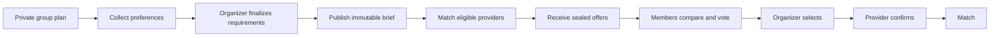
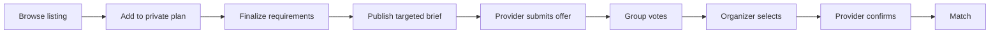

# Product Scope

## Product definition

Arat? is a group-first marketplace for casual outings. An existing group of
friends, coworkers, relatives, or club members agrees on what it needs before
choosing a venue. The group can then publish an anonymized brief to eligible
local providers and compare the structured offers it receives.

The product promise is:

> A group can move from "What should we do?" to one clear provider agreement
> without moving its plan, votes, requirements, and offers across several apps.

Arat? is not initially a payment-backed booking platform. Selecting an offer
creates a pending `Match`; provider confirmation turns it into the immutable
record of what both sides agreed to pursue. The provider remains responsible
for its real inventory, payment collection, and fulfillment.

## Problem statement

Casual group plans are usually coordinated through chat messages, polls,
spreadsheets, provider pages, and private messages. That creates recurring
problems:

- Members vote without clearly committing to attend.
- Date, headcount, budget, and requirements change in different conversations.
- An organizer repeatedly contacts providers and reformats the same request.
- Providers receive vague inquiries that are expensive to qualify.
- Offers are difficult to compare because their terms use different formats.
- A provider can quote against requirements that the group has since changed.
- Two organizers or devices can attempt to accept different offers at once.

The core engineering problem is maintaining one consistent agreement while
members collaborate, requirements are versioned, offers expire, and group and
provider actions race with each other.

## Initial market assumptions

The first release deliberately narrows marketplace liquidity:

- One dense Philippine metropolitan area is configured for the deployment.
- The common use case is an after-work or weekend outing.
- A typical group has 4 to 20 expected attendees.
- Initial categories are badminton and other activity courts, KTV or private
  activity rooms, and group dining.
- Providers can respond only when verified, active, and matched by category and
  service area.
- Members already know one another. Arat? does not introduce strangers.
- Philippine peso is the only displayed currency in the first release.
- Group accounts are free. Verified providers may submit offers without
  metering in Release 1.

These are product assumptions to validate, not claims about market demand.

## Primary actors

### Group member

- Belongs to a private group through an invitation
- Suggests or reviews a plan
- Records availability, expected guest count, and attendance intent
- Reviews provider offers visible to the group
- Casts one advisory vote per offer

### Group organizer

An organizer has all member capabilities and can also:

- Define and edit requirements while a plan is private
- Publish an anonymized, versioned provider brief
- Distribute the brief to matched providers
- In the listing extension, invite a provider directly from a listing
- Select one eligible offer
- Cancel a plan or record that an outing was completed

Votes inform the organizer but do not authorize an acceptance. Only an
organizer can select an offer in the first release.

### Provider member

- Manages a verified provider profile
- In the listing extension, manages service listings
- Receives only briefs for which the provider is an eligible recipient
- Submits structured offers without seeing competitors' offers
- Withdraws an unselected offer
- Confirms or declines a selected offer before its deadline

### Marketplace operator

- Reviews provider verification submissions
- Investigates reports and applies account restrictions; listing restrictions
  arrive with the listing extension
- Observes delivery failures, expired offers, and transition conflicts
- In the billing extension, exercises simulated subscription events in a
  development environment

An operator cannot silently edit a published brief, submitted offer, or
confirmed match.

## Core journeys

### Request-first journey



Example brief:

```text
Category: Badminton
Area: Within the configured BGC service area
Schedule: Friday, 5:00 PM to 7:00 PM
Expected attendance: 8 to 10 people
Need: 2 courts, parking, and shower access
Budget ceiling: PHP 2,500 total
Offer deadline: Thursday, 6:00 PM
```

### Later listing extension

A member may browse a provider listing and propose it to the group. If the
group wants a quote, the organizer publishes the same type of immutable brief
and targets that verified provider. The listing is discovery context, not a
separate booking system.



Both journeys converge on the same `PublishedRequest -> Offer -> Match` domain
workflow and the same correctness rules.

## Release 1 capabilities

### Private groups

- Create a group and invite known members through expiring links
- Assign member and organizer roles
- Remove, leave, or transfer organizer access under explicit rules
- Keep membership and internal planning data private

### Collaborative planning

- Create a plan under one group
- Record date and time options, area, headcount range, budget, category, and
  structured requirements
- Record each member's availability, attendance intent, guest count, and budget
  preference
- Distinguish interest from intent to join
- Let the organizer freeze one set of requirements for publication

### Provider request marketplace

- Create an immutable numbered request version from current requirements
- Maintain the provider profile, category, service area, contact channel, and
  verification status required for matching
- Distribute the request to matched verified providers
- Reveal only the anonymized information needed to quote
- Close, cancel, or supersede a request without rewriting its history
- Prevent providers outside the request audience from discovering it

### Offers and selection

- Submit a structured offer for one request version
- Capture schedule, capacity, price, inclusions, conditions, cancellation terms,
  and offer expiration
- Keep offers sealed from competing providers
- Permit one advisory member vote per offer
- Let the organizer select one currently eligible offer idempotently
- Give the selected provider a server-controlled confirmation period
- Allow another eligible offer to be selected after a decline or timeout
- Produce one immutable confirmed match for the plan

### Notifications and auditability

- Record material domain events transactionally
- Deliver retryable in-app or inspectable local email notifications
- Show a group-facing timeline of requirement publication, offers, selection,
  confirmation, expiration, and cancellation
- Preserve actor, timestamp, and correlation identifiers for sensitive actions

## Later extensions

### Listing-first discovery

- Publish structured provider listings for group discovery
- Pause or archive listings without erasing historical offer references
- Treat displayed availability as informative unless the provider explicitly
  confirms an offer
- Let an organizer send the same immutable request format directly to a
  provider selected from a listing

### Simulated provider subscriptions

The draft billing policy is deliberately small:

- Groups remain free.
- Verified providers submit without metering until the billing extension is
  enabled.
- Once enabled, Free allows 10 proactive matched-pool offers per provider
  organization per Asia/Manila calendar month. Responses to direct invitations
  remain unlimited.
- Simulated Pro is an illustrative PHP 499 per provider organization per month
  and allows unlimited proactive offers.
- The system stores simulated plan, entitlement, usage, and lifecycle events.
  It does not collect payment credentials or create invoices.
- Paid status never affects provider verification, organic ranking, or access
  to relevant group requests.
- Downgrades restrict new metered actions but do not hide historical offers,
  matches, usage, or audit records.

This policy is an unvalidated product assumption. It is not a market-tested
price or a real payment model.

## Product state model

The canonical plan, request, offer, match, membership, verification, and listing
state machines live in the [Domain and Data Model](domain-model.md). Other
documents refer to those names but do not define alternate transition graphs.

At product level, the important path is:

```text
DRAFT -> COLLABORATING -> OPEN_FOR_OFFERS -> MATCH_PENDING -> MATCHED
```

An unsuccessful pending selection returns to `OPEN_FOR_OFFERS` only while the
current request remains before its deadline; otherwise it returns to
`COLLABORATING`. Publishing a replacement request keeps the plan
`OPEN_FOR_OFFERS`. Cancelling only a pending selection follows the same
reopen-or-close rule. Cancelling the plan or a confirmed match makes the plan
terminal, so a new provider attempt uses a new plan.

## Essential invariants

1. Every plan belongs to exactly one private group.
2. A published request is an immutable snapshot with a monotonically increasing
   version number within its plan.
3. An offer references exactly one published request version.
4. A request that is pending selection, superseded, closed, or cancelled cannot
   accept new offers.
5. A materially changed requirement must be published as a new version.
6. An expired or withdrawn offer cannot be selected.
7. Provider terms cannot change after submission; a changed quote is a new
   offer revision.
8. At most one active match exists for a plan.
9. At most one confirmed match ever exists for a plan unless a future product
   explicitly introduces multi-provider plans.
   Cancelling after confirmation terminates that plan; another provider attempt
   uses a new plan.
10. Retrying selection or confirmation with the same idempotency key returns the
    original outcome and does not create another match.
11. Provider confirmation after its deadline is rejected deterministically.
12. One active group member has at most one current vote per offer.
13. Group membership changes do not rewrite a published request, submitted
    offer, or confirmed match.
14. A provider can read a request only if it is an authorized recipient.
15. Competing providers cannot read each other's offers.

## Explicit non-goals

The first release does not include:

- Provider listing discovery or direct listing invitations
- Provider subscription metering or simulated Pro lifecycle
- Public plans or stranger recruitment
- A public social feed
- Direct or group chat
- Real card, bank, GCash, or Maya payments
- Deposits, refunds, escrow, commissions, or payment protection
- A guarantee that provider inventory is available before provider confirmation
- Ratings and reviews
- AI recommendations, itinerary generation, or chat assistants
- Multi-provider packages for one plan
- Open auctions or providers seeing competing prices
- Dynamic pricing
- Full provider calendars or instant booking
- Route optimization or live location tracking
- Native mobile applications
- Production identity verification services
- Nationwide category and location coverage
- Emergency, medical, adult, or regulated service categories

## Honest product boundaries

- A `Match` is evidence of a confirmed offer, not proof of payment or service
  fulfillment.
- Arat? does not guarantee provider quality merely because basic verification
  succeeded.
- The provider owns the operational calendar in the first release.
- The system can enforce its internal state, but it cannot prevent a provider
  from accepting an offline booking outside Arat?.
- The expected load is marketplace-wide traffic and concurrent group activity,
  not thousands of people competing for one badminton court.
- Performance and capacity claims require measured tests; this document makes
  none.

## Success criteria

Release 1 is ready when:

1. A complete request-first journey ends through the offer and match workflow.
2. Authorization tests prove that plans are private, recipients are scoped, and
   offers remain sealed from competitors.
3. Concurrency tests prove that simultaneous selections create at most one
   active match.
4. Selection-versus-expiration, selection-versus-withdrawal, and
   confirmation-versus-timeout races have deterministic outcomes.
5. Tests prove that editing requirements creates a new immutable request version
   and cannot mutate an existing offer's context.
6. Duplicate commands and asynchronous deliveries are harmless.
7. The application and realistic test infrastructure run locally without a
   paid cloud account.
8. A reproducible load scenario exercises the provider request feed, request
   publication, match fan-out, offers, votes, selection, and notifications
   without fabricated results.
9. Documentation clearly separates a match from a payment-backed booking.
10. Acceptance testing uses only the bounded categories, geography, and trust
    model described here.

## Later validation questions

These are product questions, not committed features:

- Do groups prefer provider offers over browsing listings directly?
- What minimum brief data allows a provider to quote without follow-up chat?
- How many relevant requests justify a provider subscription?
- Should a provider be able to place a time-limited inventory hold before
  confirmation?
- Which categories require category-specific capacity or compliance fields?
- At what point would payment protection create enough value to justify fees?
