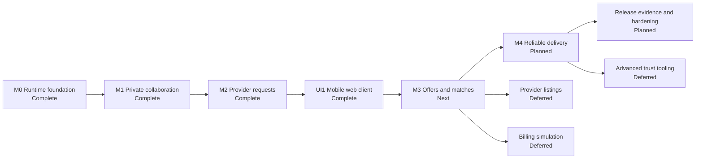

# Project Roadmap

## Purpose

This document is the public delivery sequence for Arat?. It shows which product
slices are implemented, what comes next, and what evidence is required before a
milestone is called complete.

Milestone and phase numbers refer to the same delivery sequence. This document
uses `M0`, `M1`, and so on consistently.

Current stage: UI1 is complete. M3 is next, with its number and marketplace
scope unchanged.

## Status vocabulary

| Status | Meaning |
| --- | --- |
| Complete | Behavior and its required evidence are committed and runnable from a clean checkout. |
| Next | The next implementation slice; its behavior is not yet claimed. |
| Planned | Sequenced core work that has not started. |
| Deferred | An optional extension outside the current Release 1 path. |

The roadmap does not use percentages or calendar estimates. A status changes
only when the implementation, migrations, tests, and directly affected public
documentation agree.

## Delivery sequence

## Core milestones

### M0: Runtime foundation - Complete

Outcome:

- A Java 21 Spring Boot application starts locally against PostgreSQL.
- Flyway owns repeatable schema creation.
- Health, Prometheus metrics, structured logging, local authentication, Docker
  Compose, Testcontainers, and CI verification are available.

Completion evidence includes the normal `./mvnw clean verify` lane, migration
tests, architecture tests, container build, and `scripts/smoke-foundation.sh`.
Normal development requires no AWS account or paid service.

### M1: Private collaboration - Complete

Outcome:

- Known users can create a private group, invite members, transfer organizer
  authority, and leave or remove members under explicit rules.
- Active members can create and read collaborative plans and record their own
  preferences.
- Organizers can replace requirement drafts and cancel plans with version and
  idempotency safeguards.

Primary evidence:

- `MilestoneOneJourneyIT` exercises the public HTTP journey and executable
  OpenAPI contract.
- `CollaborationRaceOutcomesIT` proves the required PostgreSQL race outcomes
  with separate transactions and deterministic coordination.
- Focused integration tests cover authorization, privacy, idempotency, ETags,
  audit records, and failure rollback.

### M2: Versioned provider requests and recipient privacy - Complete

Outcome:

- An organizer can finalize one active window and provider-publishable terms
  without deriving terms silently from advisory preferences, then publish an
  immutable allowlisted snapshot of that finalization. Publishable free text
  has no automatic PII detection or redaction guarantee.
- Provider creation atomically grants its creator active ADMIN membership;
  scoped staff profiles and operator verification maintain monotonic eligibility.
- VERIFIED providers match by exact category and configured opaque area code;
  radius is context only. Distinct providers are UUID-ordered before a bounded
  cap (default 100, configurable 1-500); zero or excess rejects publication.
- Only persisted request recipients can discover and read the provider-safe
  projection.
- Private drafts and preferences remain editable while N is open. Finalizing
  and directly publishing N+1 atomically supersedes N without a close-first gap.
- Group history and provider detail/feed preserve privacy and eligibility
  fencing, including after suspension/restoration. Closure and cancellation
  clear the current pointer and preserve history.
- The publication transaction records recipient notification work in a durable
  outbox; queue delivery remains disabled until M4.

Completion requires executable proof that request versions are immutable,
publishing a replacement atomically supersedes the current request, provider
suspension invalidates stale eligibility, and private group data never appears
in provider responses. The same tests prove that request state, recipients, and
their outbox rows commit or roll back together. Recipient selection remains
synchronous and database-backed. M2 ends at publication and authorized access;
it includes no relay, AWS SDK, SQS, Floci, inbox, SMTP, email rendering, retries,
or DLQ behavior. Those delivery components begin in M4. Tests also prove real
PostgreSQL provider-root/FK lock compatibility and compact resource-based replay
of maximum multibyte snapshots with sensitive-looking valid attribute keys.
Executable evidence includes `MilestoneTwoJourneyIT` for the complete HTTP and
OpenAPI journey, focused rollback and separate-connection race suites, database
immutability tests, and the normal `./mvnw clean verify` lane. M2 persists
durable pending outbox rows but does not relay or deliver them.

### UI1: Mobile web client for M0-M2 - Complete

The [Mobile Web Client Contract](web-client.md) documents the implemented
Angular client, routes, HTTP semantics, same-origin boundary, mobile rules,
and local identity limitations.

Outcome:

- Privacy-scoped group, provider, and finalization discovery plus an exact
  pending-verification operator queue support fresh-session and deep-link use.
- Organizers and members can create groups and plans, share/accept invitations,
  edit requirements/preferences, finalize, publish, inspect, close and cancel.
- Provider staff can create and maintain their contexts, submit verification,
  and inspect eligible request feeds; operators can accept/reject exact pending
  submissions. Suspension and restoration remain API-only.
- The local-only actor selector and same-origin runtime demonstrate M2 without
  claiming production authentication or pulling offers and matches forward.

Completion evidence is committed: independent backend/frontend gates,
generated OpenAPI contract checks, mobile Playwright and accessibility checks
at 320/360/390 CSS pixels, a desktop smoke, reload and actor-isolation tests,
production fake-token exclusion, and an isolated Compose smoke. Browser tests
supplement PostgreSQL invariant evidence. UI1 is inserted between M2 and M3
without renumbering the existing milestones.

### M3: Offers, selection, and provider confirmation - Next

Outcome:

- Recipients can submit sealed, expiring offers against one exact request
  version.
- Members can cast advisory votes, an organizer can select one eligible offer,
  and the selected provider can confirm or decline before a deadline.
- A confirmed match preserves the agreed request and offer terms.
- Offer and match transitions append their events to the outbox created in M2.

Completion requires deterministic PostgreSQL tests for competing selections,
withdrawal, expiration, request supersession, provider suspension,
confirmation, decline, and timeout. At most one active match may exist for a
plan, and command retries must not duplicate state or events.

### M4: Outbox relay and reliable delivery - Planned

Outcome:

- The durable events captured by M2 and M3 are relayed asynchronously without
  making core transactions depend on queue or email availability.
- Local development uses Floci for SQS and its dead-letter queue, Mailpit for
  email inspection, and a durable inbox for consumer deduplication.

Completion requires failure tests around every important crash boundary:
rollback before commit, duplicate publish, duplicate delivery, expired claims,
consumer restart, poison messages, and email outage. Business state and its
outbox event must already commit atomically before this delivery layer runs.

## Release 1 gate

Release 1 consists of M0 through M4, the intervening UI1 client, and evidence
and hardening for the implemented request-first journey. Before that label is
used, the repository must also contain:

- a clean-checkout end-to-end demonstration;
- synchronized OpenAPI, diagrams, ADRs, and known limitations;
- reproducible workloads for the implemented hot paths;
- query-plan and index evidence for critical database operations;
- observable failure behavior and concise recovery instructions; and
- performance results only when the revision, environment, data set, workload,
  and raw output are available.

## Deferred extensions

The following remain deliberately outside the core sequence until M3 or M4
proves the underlying workflow:

- provider listings, listing-first discovery, and direct invitations;
- simulated Free and Pro provider subscriptions;
- advanced operator cases, reports, and abuse controls;
- geospatial search and cloud deployment; and
- recommendations, native mobile applications, real payments, public groups,
  chat, and multi-provider packages.

Deferred does not mean rejected. Each extension needs a concrete user problem
and must reuse the same request, offer, and match invariants rather than create
a parallel workflow.

## Related documents

- [Product Scope](product-scope.md)
- [Architecture](architecture.md)
- [Domain and Data Model](domain-model.md)
- [API Contract](api-contract.md)
- [Mobile Web Client Contract](web-client.md)
- [Consistency and Concurrency](consistency-and-concurrency.md)
- [Testing Strategy](testing-strategy.md)
- [Architecture Decision Records](adr/README.md)
